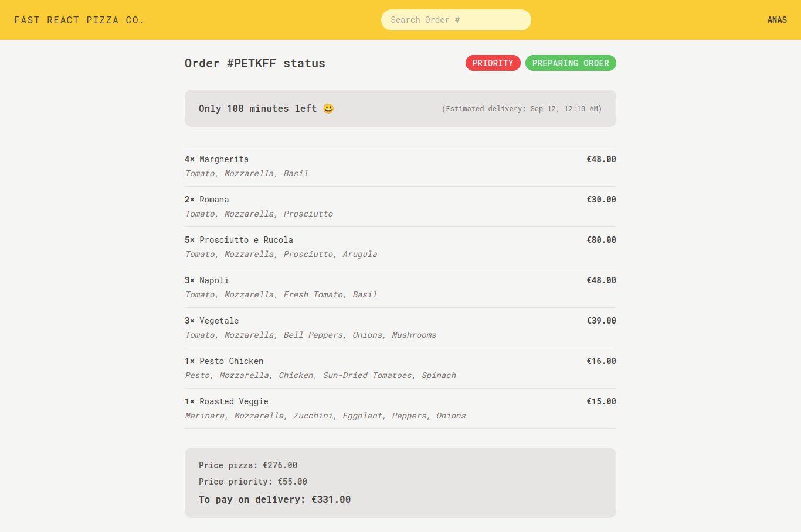

# Fast React Pizza 🍕

Welcome to **Fast React Pizza**, a modern web application for managing pizza orders. This project uses React, Vite, and Redux Toolkit to deliver a fast and responsive pizza ordering experience.

## 🚀 Live Demo

Check out the live demo of the project here: [Fast React Pizza](https://fast-react-pizza-2193.netlify.app/)

## 🗂️ Project Features

- **Menu Management**: View and select your favorite pizzas from the menu.
- **Cart Management**: Add items to your cart and update quantities.
- **Order Processing**: Place orders and review your order history.
- **Responsive Design**: Fully responsive layout for an optimal experience on any device.

## 🖼️ Screenshots

### Cart


### Menu


### Order



## ⚙️ Getting Started

To get started with this project locally, follow these steps:

### 1. Clone the Repository

```bash
git clone https://github.com/AnasHany2193/Fast-React-Pizza.git
cd Fast-React-Pizza
```

### 2. Install Dependencies

```bash
npm install
```

### 3. Start the Development Server

```bash
npm run dev
```

## 🔧 Technologies Used

- **React**: A JavaScript library for building user interfaces.
- **Vite**: A fast build tool for modern web projects.
- **Redux Toolkit**: A powerful tool for managing global state.
- **Tailwind CSS**: A utility-first CSS framework for styling.

## 💬 Contact

For any questions or feedback, feel free to reach out:

- **LinkedIn**: [Anas Hany](https://www.linkedin.com/in/anashany219/)

Happy coding! 🎉
